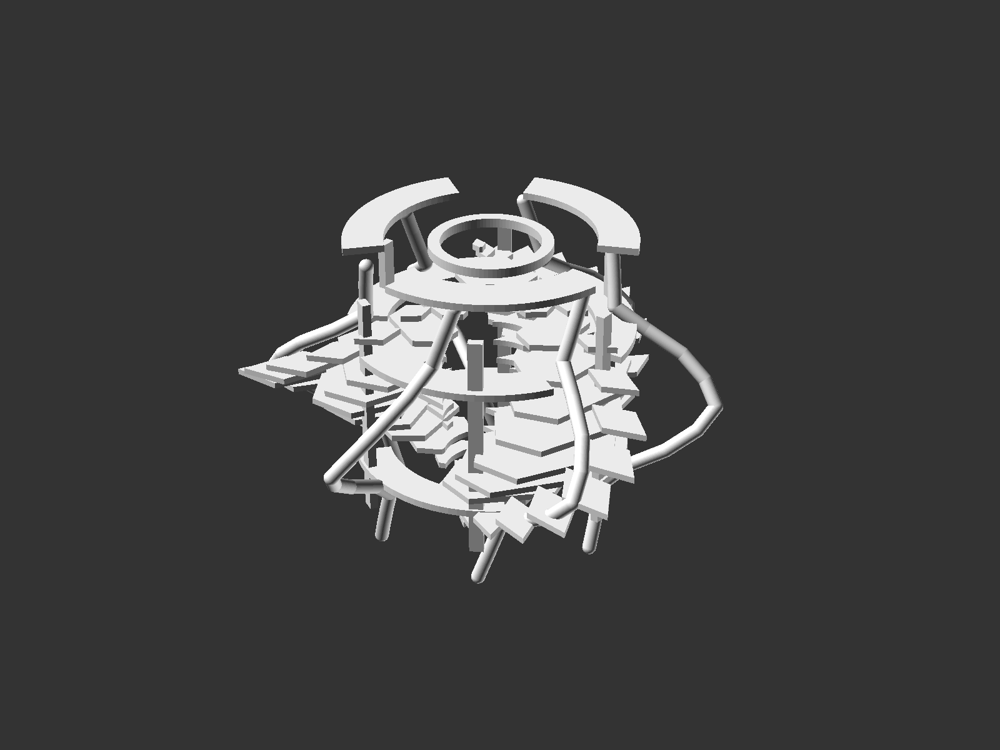
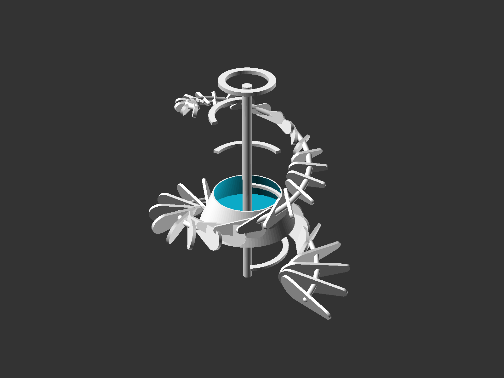
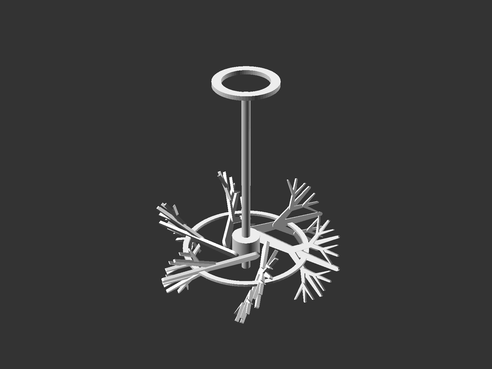
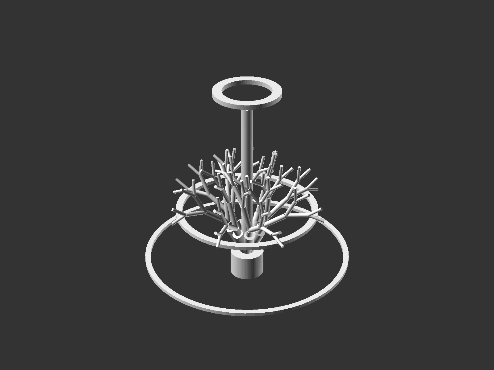
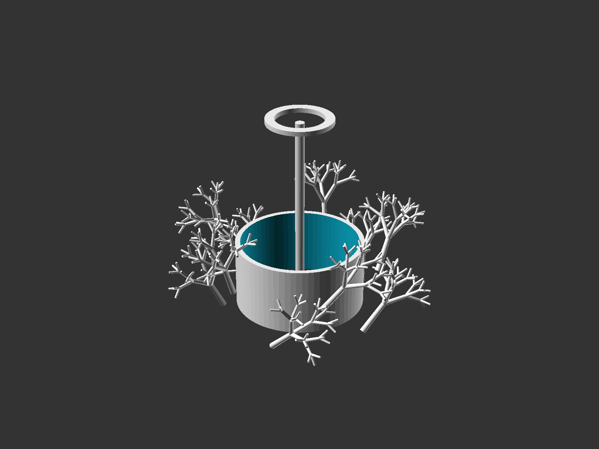

# Fracta

A collection of parametric pendant lamp designs inspired by fractal geometry and natural growth patterns. Each lamp is modeled in OpenSCAD using the BOSL2 library, designed around standard IKEA E27 pendant hardware, and intended for 3D printing or digital fabrication.

## The Lamps

### Fracta Snow
Inspired by the Koch snowflake and crystalline radial symmetry. A layered pendant shade built from recursive snowflake profiles with support ribs and helical connectors.

---

### Fracta Spiral
A sculptural pendant built from repeated teardrop fins arranged along a helical path. Captures upward motion and dynamic flow around a central bulb cavity.

---

### Fracta Fern
An organic branching shade inspired by fern fronds and botanical self-similarity. Features radial arms that radiate from a central hub like layered fern growth.

---

### Fracta Canopy
A dome-like pendant derived from branching tree canopy logic. Structural members spread outward from a top hub to create an architectural, sheltering form.

---

### Fracta Coral
A porous sculptural lamp inspired by reef branching and marine growth patterns. Dense clustering of branching members creates a luminous, atmospheric volume.

---

## Design Principles

- **Parametric** – All dimensions are adjustable variables for easy iteration
- **Hardware-compatible** – Designed around IKEA E27 pendant socket standards
- **Manufacturable** – Structures favor single-piece 3D printing or simple assembly
- **Iterative** – Each lamp developed through render-reviewed design cycles
- **Open** – Built with OpenSCAD and the open-source BOSL2 library

## Project Structure

Each lamp folder contains:
- `openscad/*.scad` – Parametric OpenSCAD source
- `renders/` – Isometric and orthographic PNG renders
- `reference/hardware-notes.md` – Hardware interface assumptions
- `README.md` – Concept brief
- `progress.md` – Development notes

## Getting Started

1. Install [OpenSCAD](https://openscad.org/)
2. Install [BOSL2](https://github.com/BelfrySCAD/BOSL2) (place in your OpenSCAD library path)
3. Open any `openscad/*.scad` file in OpenSCAD
4. Adjust parameters at the top of each file
5. Render (F6) and export as needed

## License

[Add your license here]
